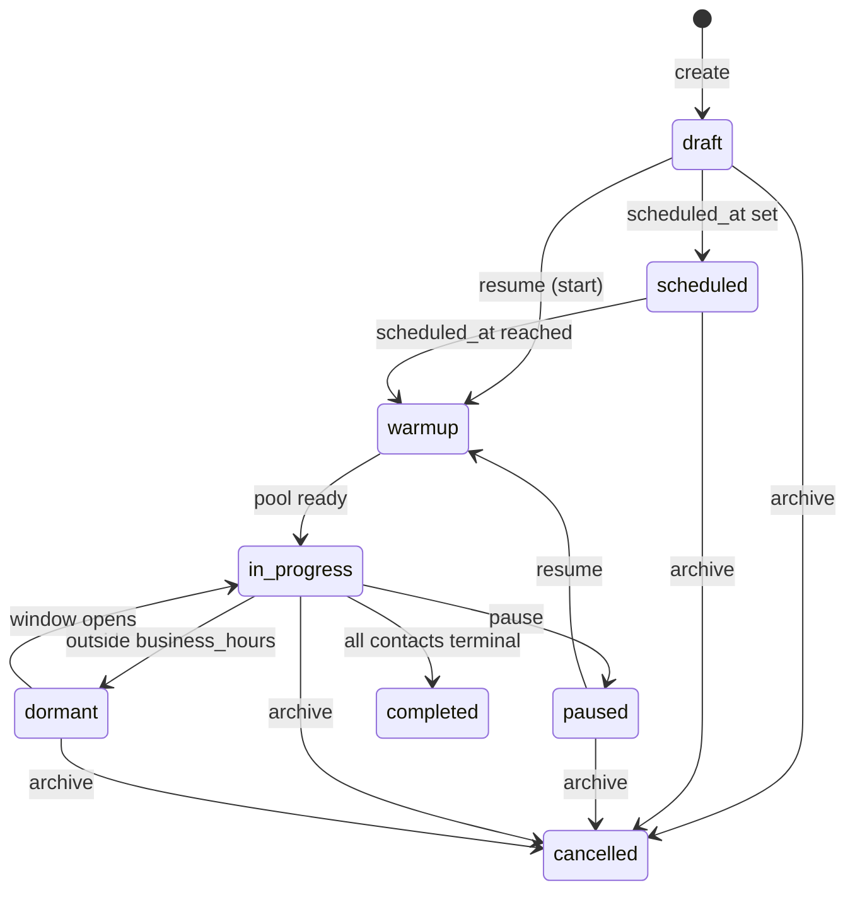

The Batch Campaign API lets you launch and manage outbound AI voice campaigns from your own backend. You upload a list of contacts, point them at one of your agents and one of your phone numbers, and Verbeo handles dialing, retries, and finalization.

<CardGroup cols={2}>
  <Card title="Quickstart" icon="rocket" href="#quickstart">
    Send your first campaign in under five minutes.
  </Card>

  <Card title="Endpoints" icon="code" href="#endpoints">
    Seven actions: create, status, stats, update, pause, resume, archive.
  </Card>
</CardGroup>

## Base URL

All requests go to:

```text
https://api.verbeo.ai/v1
```

Every endpoint is `POST` and accepts JSON.

## Authentication

Authenticate with a workspace API key in the `Authorization` header.

```bash
curl https://api.verbeo.ai/v1/campaign/status \
  -H "Authorization: Bearer vbr_<YOUR_API_KEY>" \
  -H "Content-Type: application/json" \
  -d '{"campaign_id":"<UUID>"}'
```

Keys are workspace-scoped. Each key carries one of two prefixes:

| Prefix | Type | Use case |
| --- | --- | --- |
| `vbr_` | Private | Server-to-server. Treat like a database password. |
| `vbr_pub_` | Public | Client-side / browser. Limited surface. |

Generate, name, and revoke keys in the dashboard at **Settings → API Keys**. The full secret is shown **once at creation** — Verbeo only stores the SHA-256 hash, so a lost key cannot be recovered, only revoked and replaced.

<Note>
  Keys can be set to expire. An expired or inactive key returns `401 UNAUTHORIZED`.
</Note>

## Quickstart

<Steps>
  <Step title="Create an API key">
    Open the dashboard, go to **Settings → API Keys**, click **Create key**, and copy the secret. It starts with `vbr_`.
  </Step>
  <Step title="Note an agent and a phone number">
    From the dashboard's **Agents** and **Phone Numbers** pages, copy a UUID from each (or use the E.164 phone number directly).
  </Step>
  <Step title="Create a campaign">
    ```bash
    curl https://api.verbeo.ai/v1/campaign/create \
      -H "Authorization: Bearer vbr_<YOUR_API_KEY>" \
      -H "Content-Type: application/json" \
      -d '{
        "campaign_name": "May launch",
        "agent_id": "<AGENT_UUID>",
        "phone_number_id": "<PHONE_UUID>",
        "contacts": [
          { "phone_number": "+15551234567", "contact_name": "Jane Doe" }
        ],
        "max_retries": 2,
        "retry_intervals": [60, 180]
      }'
    ```

    The response includes a `campaign_id`. The campaign is created in `draft` state — it will not dial yet.
  </Step>
  <Step title="Start dialing">
    ```bash
    curl https://api.verbeo.ai/v1/campaign/resume \
      -H "Authorization: Bearer vbr_<YOUR_API_KEY>" \
      -H "Content-Type: application/json" \
      -d '{"campaign_id":"<CAMPAIGN_UUID>"}'
    ```

    `/resume` covers both **starting** a fresh campaign and **resuming** a paused one.
  </Step>
  <Step title="Check progress">
    ```bash
    curl https://api.verbeo.ai/v1/campaign/status \
      -H "Authorization: Bearer vbr_<YOUR_API_KEY>" \
      -H "Content-Type: application/json" \
      -d '{"campaign_id":"<CAMPAIGN_UUID>"}'
    ```
  </Step>
</Steps>

## Endpoints

Every successful response is wrapped in this envelope:

```json
{ "success": true, "data": { /* payload */ }, "message": "optional" }
```

Every error follows:

```json
{ "success": false, "error": "<human-readable>", "code": "<MACHINE_CODE>" }
```

<AccordionGroup>
  <Accordion title="POST /campaign/create — Create a campaign" defaultOpen icon="plus">
    Creates a campaign in `draft` state (or `scheduled` if `scheduled_at` is set). Contacts are inserted in bulk; if any contact insert fails the whole campaign is rolled back.

    <RequestExample>

    ```bash cURL
    curl https://api.verbeo.ai/v1/campaign/create \
      -H "Authorization: Bearer vbr_<KEY>" \
      -H "Content-Type: application/json" \
      -d '{
        "campaign_name": "May launch",
        "agent_id": "9b1c…",
        "phone_number_id": "f08d…",
        "contacts": [
          { "phone_number": "+15551234567", "contact_name": "Jane Doe", "custom_data": { "tier": "gold" } }
        ],
        "max_retries": 2,
        "retry_intervals": [60, 180],
        "business_hours": {
          "tz": "America/New_York",
          "days": [1, 2, 3, 4, 5],
          "windows": [{ "start": 540, "end": 1020 }]
        }
      }'
    ```

    ```js Node.js
    const res = await fetch("https://api.verbeo.ai/v1/campaign/create", {
      method: "POST",
      headers: {
        "Authorization": `Bearer ${process.env.VERBEO_API_KEY}`,
        "Content-Type": "application/json",
      },
      body: JSON.stringify({
        campaign_name: "May launch",
        agent_id: "9b1c…",
        phone_number_id: "f08d…",
        contacts: [
          { phone_number: "+15551234567", contact_name: "Jane Doe" },
        ],
        max_retries: 2,
        retry_intervals: [60, 180],
      }),
    });
    const json = await res.json();
    ```

    ```python Python
    import os, requests
    
    res = requests.post(
        "https://api.verbeo.ai/v1/campaign/create",
        headers={
            "Authorization": f"Bearer {os.environ['VERBEO_API_KEY']}",
            "Content-Type": "application/json",
        },
        json={
            "campaign_name": "May launch",
            "agent_id": "9b1c…",
            "phone_number_id": "f08d…",
            "contacts": [
                {"phone_number": "+15551234567", "contact_name": "Jane Doe"},
            ],
            "max_retries": 2,
            "retry_intervals": [60, 180],
        },
    )
    print(res.json())
    ```

    </RequestExample>

    ### Body

    <ParamField body="campaign_name" type="string" required>
      Display name shown in the dashboard.
    </ParamField>

    <ParamField body="agent_id" type="string (UUID)" required>
      ID of an agent in your workspace. Find it in **Dashboard → Agents**.
    </ParamField>

    <ParamField body="phone_number_id" type="string (UUID)">
      ID of a phone number in your workspace. Either this **or** `phone_number` is required.
    </ParamField>

    <ParamField body="phone_number" type="string (E.164)">
      Phone number in E.164 format (e.g. `+15551234567`). Looked up by value in your workspace. Either this **or** `phone_number_id` is required.
    </ParamField>

    <ParamField body="contacts" type="array<Contact>" required>
      Recipients to dial. Must contain at least one entry.

      <Expandable title="Contact object">
        <ParamField body="phone_number" type="string (E.164)" required>
          Number to dial.
        </ParamField>

        <ParamField body="contact_name" type="string">
          Display name. Available to the agent at runtime.
        </ParamField>

        <ParamField body="custom_data" type="object">
          Arbitrary JSON, surfaced to the agent and post-call analysis.
        </ParamField>
      </Expandable>
    </ParamField>

    <ParamField body="max_retries" default="0" type="number">
      Maximum number of retry attempts per failed contact.
    </ParamField>

    <ParamField body="retry_intervals" default="[]" type="number[]">
      Per-attempt delays in **minutes**. The Nth retry waits `retry_intervals[N-1]` minutes after the previous attempt. If the array is shorter than `max_retries`, the last value is reused.
    </ParamField>

    <ParamField body="scheduled_at" type="string (ISO 8601)">
      Future timestamp at which the campaign should auto-start. Sets the initial status to `scheduled` instead of `draft`.
    </ParamField>

    <ParamField body="business_hours" type="BusinessHours | null">
      Time-of-day / weekday gate for outbound dialing. Omit or send `null` for 24/7 dispatch.

      <Expandable title="BusinessHours object">
        <ParamField body="tz" type="string" required>
          IANA timezone (e.g. `America/New_York`, `Europe/London`).
        </ParamField>

        <ParamField body="days" type="number[]" required>
          Allowed ISO weekdays — `1` = Monday … `7` = Sunday. Pick at least one.
        </ParamField>

        <ParamField body="windows" type="array<Window>" required>
          One or more daily windows, each `{ start, end }` in **minutes since local midnight**. `0 ≤ start < end ≤ 1440`. Cross-midnight windows aren't supported — split them into two windows on adjacent days.
        </ParamField>
      </Expandable>
    </ParamField>

    <Note>
      `business_hours` is validated server-side before the campaign is created. Invalid configs return `400 INVALID_BUSINESS_HOURS` with the full error list.
    </Note>

    ### Response

    <ResponseExample>

    ```json 201 Created
    {
      "success": true,
      "data": {
        "campaign_id": "5f2c…",
        "campaign_name": "May launch",
        "status": "draft",
        "total_contacts": 1,
        "business_hours": {
          "tz": "America/New_York",
          "days": [1, 2, 3, 4, 5],
          "windows": [{ "start": 540, "end": 1020 }]
        },
        "scheduled_at": null,
        "created_at": "2026-05-04T15:00:00.000Z"
      },
      "message": "Campaign created successfully"
    }
    ```

    </ResponseExample>

    ### Errors

    | Code | When |
    | --- | --- |
    | `MISSING_FIELD` | `campaign_name`, `agent_id`, `contacts`, or both phone identifiers missing. |
    | `INVALID_CONTACT` | A contact entry has no `phone_number`. |
    | `INVALID_BUSINESS_HOURS` | `business_hours` failed validation (bad tz, empty days, overlapping windows, etc.). |
    | `PHONE_NOT_FOUND` | The phone UUID/E.164 isn't in your workspace. |
    | `AGENT_NOT_FOUND` | The agent UUID isn't in your workspace. |
    | `CREATE_FAILED` | Database error. Retry is safe — no partial campaign is left behind. |
    | `CONTACTS_INSERT_FAILED` | Bulk contact insert failed; the campaign was rolled back. Retry. |
  </Accordion>

  <Accordion title="POST /campaign/status — Get current status" icon="circle-info">
    Returns the latest campaign state and aggregate counters. Cheap; safe to poll.

    <RequestExample>

    ```bash cURL
    curl https://api.verbeo.ai/v1/campaign/status \
      -H "Authorization: Bearer vbr_<KEY>" \
      -H "Content-Type: application/json" \
      -d '{"campaign_id":"5f2c…"}'
    ```

    ```js Node.js
    const res = await fetch("https://api.verbeo.ai/v1/campaign/status", {
      method: "POST",
      headers: {
        "Authorization": `Bearer ${process.env.VERBEO_API_KEY}`,
        "Content-Type": "application/json",
      },
      body: JSON.stringify({ campaign_id: "5f2c…" }),
    });
    ```

    ```python Python
    import os, requests
    requests.post(
        "https://api.verbeo.ai/v1/campaign/status",
        headers={"Authorization": f"Bearer {os.environ['VERBEO_API_KEY']}"},
        json={"campaign_id": "5f2c…"},
    )
    ```

    </RequestExample>

    ### Body

    ### Response

    <ResponseExample>

    ```json 200 OK
    {
      "success": true,
      "data": {
        "campaign_id": "5f2c…",
        "campaign_name": "May launch",
        "status": "in-progress",
        "total_contacts": 250,
        "completed_calls": 87,
        "successful_calls": 64,
        "failed_calls": 23,
        "started_at": "2026-05-04T15:05:00.000Z",
        "business_hours": null,
        "completed_at": null,
        "scheduled_at": null,
        "created_at": "2026-05-04T15:00:00.000Z",
        "updated_at": "2026-05-04T15:32:11.000Z"
      }
    }
    ```

    </ResponseExample>
  </Accordion>

  <Accordion title="POST /campaign/stats — Get detailed statistics" icon="chart-line">
    Same payload as `/status`, plus a per-contact-status breakdown. Use this for dashboards.

    <RequestExample>

    ```bash cURL
    curl https://api.verbeo.ai/v1/campaign/stats \
      -H "Authorization: Bearer vbr_<KEY>" \
      -H "Content-Type: application/json" \
      -d '{"campaign_id":"5f2c…"}'
    ```

    ```js Node.js
    await fetch("https://api.verbeo.ai/v1/campaign/stats", {
      method: "POST",
      headers: {
        "Authorization": `Bearer ${process.env.VERBEO_API_KEY}`,
        "Content-Type": "application/json",
      },
      body: JSON.stringify({ campaign_id: "5f2c…" }),
    });
    ```

    ```python Python
    import os, requests
    requests.post(
        "https://api.verbeo.ai/v1/campaign/stats",
        headers={"Authorization": f"Bearer {os.environ['VERBEO_API_KEY']}"},
        json={"campaign_id": "5f2c…"},
    )
    ```

    </RequestExample>

    ### Body

    ### Response

    <ResponseExample>

    ```json 200 OK
    {
      "success": true,
      "data": {
        "campaign_id": "5f2c…",
        "campaign_name": "May launch",
        "status": "in-progress",
        "total_contacts": 250,
        "completed_calls": 87,
        "successful_calls": 64,
        "failed_calls": 23,
        "contact_status_breakdown": {
          "pending": 142,
          "calling": 21,
          "completed": 64,
          "failed": 23,
          "retry_scheduled": 0,
          "cancelled": 0
        },
        "started_at": "2026-05-04T15:05:00.000Z",
        "business_hours": null,
        "completed_at": null,
        "scheduled_at": null,
        "max_retries": 2,
        "retry_intervals": [60, 180],
        "created_at": "2026-05-04T15:00:00.000Z",
        "updated_at": "2026-05-04T15:32:11.000Z"
      }
    }
    ```

    </ResponseExample>

    <ResponseField name="contact_status_breakdown" type="object">
      Counts of contacts by current status.

      <Expandable title="Breakdown">
             
      </Expandable>
    </ResponseField>

    All other fields are identical to `/campaign/status`.
  </Accordion>

  <Accordion title="POST /campaign/update — Update settings" icon="pen-to-square">
    Update campaign settings. Allowed only when the campaign is **not running** — i.e. status ∈ `{draft, scheduled, paused}`. To edit a live campaign, pause first, update, then resume.

    <RequestExample>

    ```bash cURL
    curl https://api.verbeo.ai/v1/campaign/update \
      -H "Authorization: Bearer vbr_<KEY>" \
      -H "Content-Type: application/json" \
      -d '{
        "campaign_id": "5f2c…",
        "campaign_name": "May launch — v2",
        "max_retries": 3,
        "retry_intervals": [60, 180, 600]
      }'
    ```

    ```js Node.js
    await fetch("https://api.verbeo.ai/v1/campaign/update", {
      method: "POST",
      headers: {
        "Authorization": `Bearer ${process.env.VERBEO_API_KEY}`,
        "Content-Type": "application/json",
      },
      body: JSON.stringify({
        campaign_id: "5f2c…",
        max_retries: 3,
      }),
    });
    ```

    ```python Python
    import os, requests
    requests.post(
        "https://api.verbeo.ai/v1/campaign/update",
        headers={"Authorization": f"Bearer {os.environ['VERBEO_API_KEY']}"},
        json={"campaign_id": "5f2c…", "max_retries": 3},
    )
    ```

    </RequestExample>

    ### Body

    <ParamField body="scheduled_at" type="string (ISO 8601)">
      Setting this on a `draft` campaign promotes it to `scheduled`.
    </ParamField>

    <ParamField body="business_hours" type="BusinessHours | null">
      Pass a full `BusinessHours` object to set, or explicit `null` to clear (resume 24/7 dispatch). Same shape as on `/campaign/create`.
    </ParamField>

    At least one mutable field is required. Otherwise the call returns `400 NO_UPDATES`.

    ### Response

    <ResponseExample>

    ```json 200 OK
    {
      "success": true,
      "data": {
        "campaign_id": "5f2c…",
        "campaign_name": "May launch — v2",
        "status": "draft",
        "max_retries": 3,
        "retry_intervals": [60, 180, 600],
        "scheduled_at": null,
        "business_hours": null,
        "updated_at": "2026-05-04T15:40:00.000Z"
      },
      "message": "Campaign updated successfully"
    }
    ```

    </ResponseExample>

    ### Errors

    | Code | When |
    | --- | --- |
    | `INVALID_STATUS` | Campaign is currently running. Pause first. |
    | `NO_UPDATES` | The body had `campaign_id` only — nothing to change. |
    | `INVALID_BUSINESS_HOURS` | `business_hours` failed validation. |
    | `UPDATE_FAILED` | Database error. Safe to retry. |
  </Accordion>

  <Accordion title="POST /campaign/pause — Pause" icon="pause">
    Pauses a running campaign. Forwards `action=pause` to the orchestrator, which stops dispatching new calls and returns the new state.

    <RequestExample>

    ```bash cURL
    curl https://api.verbeo.ai/v1/campaign/pause \
      -H "Authorization: Bearer vbr_<KEY>" \
      -H "Content-Type: application/json" \
      -d '{"campaign_id":"5f2c…"}'
    ```

    ```js Node.js
    await fetch("https://api.verbeo.ai/v1/campaign/pause", {
      method: "POST",
      headers: {
        "Authorization": `Bearer ${process.env.VERBEO_API_KEY}`,
        "Content-Type": "application/json",
      },
      body: JSON.stringify({ campaign_id: "5f2c…" }),
    });
    ```

    ```python Python
    import os, requests
    requests.post(
        "https://api.verbeo.ai/v1/campaign/pause",
        headers={"Authorization": f"Bearer {os.environ['VERBEO_API_KEY']}"},
        json={"campaign_id": "5f2c…"},
    )
    ```

    </RequestExample>

    ### Body

    ### Response

    A `200` response with the orchestrator's view of the transition. Already-paused campaigns return the current state unchanged.
  </Accordion>

  <Accordion title="POST /campaign/resume — Resume or start" icon="play">
    Single endpoint that **starts** a `draft`/`scheduled` campaign or **resumes** a `paused` one. Verbeo picks the right action based on current status — same mapping the dashboard's "Resume" button uses:

    | Current status | Action sent |
    | --- | --- |
    | `draft`, `scheduled` | `start` |
    | `paused` | `resume` |

    <RequestExample>

    ```bash cURL
    curl https://api.verbeo.ai/v1/campaign/resume \
      -H "Authorization: Bearer vbr_<KEY>" \
      -H "Content-Type: application/json" \
      -d '{"campaign_id":"5f2c…"}'
    ```

    ```js Node.js
    await fetch("https://api.verbeo.ai/v1/campaign/resume", {
      method: "POST",
      headers: {
        "Authorization": `Bearer ${process.env.VERBEO_API_KEY}`,
        "Content-Type": "application/json",
      },
      body: JSON.stringify({ campaign_id: "5f2c…" }),
    });
    ```

    ```python Python
    import os, requests
    requests.post(
        "https://api.verbeo.ai/v1/campaign/resume",
        headers={"Authorization": f"Bearer {os.environ['VERBEO_API_KEY']}"},
        json={"campaign_id": "5f2c…"},
    )
    ```

    </RequestExample>

    ### Body

    ### Response

    A `200` response with the orchestrator's transition payload. Note that a `scheduled` campaign with a future `scheduled_at` may go through `warmup` before reaching `in-progress`.
  </Accordion>

  <Accordion title="POST /campaign/archive — Cancel" icon="trash">
    Cancels a campaign permanently. The URL is named `archive` for historical reasons; the action sent to the orchestrator is `cancel`. Pending and retry-scheduled contacts are marked `cancelled`.

    <Warning>
      Archived campaigns cannot be restarted. Create a new campaign to re-dial the same list.
    </Warning>

    <RequestExample>

    ```bash cURL
    curl https://api.verbeo.ai/v1/campaign/archive \
      -H "Authorization: Bearer vbr_<KEY>" \
      -H "Content-Type: application/json" \
      -d '{"campaign_id":"5f2c…"}'
    ```

    ```js Node.js
    await fetch("https://api.verbeo.ai/v1/campaign/archive", {
      method: "POST",
      headers: {
        "Authorization": `Bearer ${process.env.VERBEO_API_KEY}`,
        "Content-Type": "application/json",
      },
      body: JSON.stringify({ campaign_id: "5f2c…" }),
    });
    ```

    ```python Python
    import os, requests
    requests.post(
        "https://api.verbeo.ai/v1/campaign/archive",
        headers={"Authorization": f"Bearer {os.environ['VERBEO_API_KEY']}"},
        json={"campaign_id": "5f2c…"},
    )
    ```

    </RequestExample>

    ### Body

    ### Response

    `200` with the orchestrator's confirmation.
  </Accordion>
</AccordionGroup>

## Lifecycle

Every campaign moves through this state machine. User-driven transitions are highlighted; everything else is automatic.



### Campaign statuses

| Status | Meaning |
| --- | --- |
| `draft` | Created but never started. Editable. |
| `scheduled` | Waiting for `scheduled_at` to elapse. Editable. |
| `warmup` | Spinning up the call pool before dispatch. |
| `in-progress` | Actively dialing contacts. |
| `paused` | Dispatch suspended. Editable. |
| `dormant` | Inside the lifecycle but blocked (typically outside `business_hours` or zero retry pool). Resumes automatically. |
| `completed` | Every contact reached a terminal state. |
| `cancelled` | Archived. Terminal. |

### Contact statuses

Each row in `contact_status_breakdown` from `/campaign/stats` falls into one of these:

| Status | Meaning |
| --- | --- |
| `pending` | Not yet dialed. |
| `calling` | Active call in progress. |
| `completed` | Call finished successfully. |
| `failed` | All retries exhausted. |
| `retry_scheduled` | Awaiting next retry. |
| `cancelled` | Cancelled by `archive` or business-rule. |

## Errors

### HTTP status codes

| Code | Meaning |
| --- | --- |
| `200` | Success. |
| `201` | Resource created (only `/campaign/create`). |
| `400` | Invalid input — see error `code` for the specific reason. |
| `401` | Missing, malformed, expired, or revoked API key. |
| `404` | Endpoint, campaign, agent, or phone number not found in your workspace. |
| `500` | Internal error. Safe to retry with idempotency. |

### Error codes

Every `400`/`401`/`404`/`500` response carries a machine-readable `code`:

| Code | Cause |
| --- | --- |
| `MISSING_FIELD` | A required body field is missing. |
| `INVALID_JSON` | Request body is not valid JSON. |
| `INVALID_ENDPOINT` | Path doesn't match any handler. |
| `UNAUTHORIZED` | Missing/invalid/expired/inactive API key. |
| `INVALID_CONTACT` | A contact entry is missing `phone_number`. |
| `INVALID_BUSINESS_HOURS` | `business_hours` failed shape or value validation. The `error` message lists every issue. |
| `INVALID_STATUS` | Action not allowed in the current campaign status (most often `update` on a running campaign). |
| `NO_UPDATES` | `update` body had no mutable fields. |
| `PHONE_NOT_FOUND` | Phone UUID/E.164 isn't in your workspace. |
| `AGENT_NOT_FOUND` | Agent UUID isn't in your workspace. |
| `CAMPAIGN_NOT_FOUND` | Campaign UUID isn't in your workspace. |
| `ORCHESTRATOR_ERROR` | Internal coordinator error. Retry. |
| `CREATE_FAILED` | Database error during campaign insert. |
| `CONTACTS_INSERT_FAILED` | Database error during bulk-contact insert. The campaign was rolled back. |
| `UPDATE_FAILED` | Database error during update. |
| `STATS_FAILED` | Could not aggregate contact stats. |
| `INTERNAL_ERROR` | Catch-all server error. |

<Tip>
  Always read the `code`, not the `error` text — messages may be tweaked, codes are stable.
</Tip>